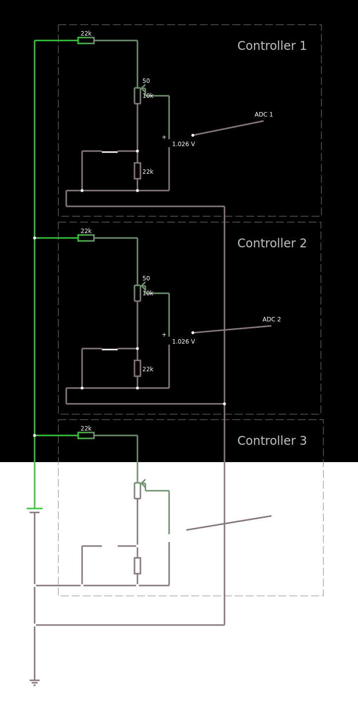

# Interactive music game/toy prototype

Music toy used with a custom paddle-style controller that communicates via web serial.

## [Live Demo](https://drohen.github.io/paddle-game/) ((d[-_-]b))

## Contents

* [What is does](#what-is-does)
* [Controls](#controls)
	+ [With Controller](#with-controller)
	+ [With Keyboard](#with-keyboard)
* [Try it out and build it yourself](#try-it-out-and-build-it-yourself)
	+ [Pico](#pico)
	+ [Web Application](#web-application)
* [What is the purpose of this project?](#what-is-the-purpose-of-this-project-)
* [Project inspirations](#project-inspirations)
* [Project design](#project-design)
	+ [Code](#code)
	+ [Circuits](#circuits)
	+ [Color palette](#color-palette)
	+ [Controllers](#controllers)
* [Author](#author)

## What is does

A Raspberry Pi Pico listens on [all 3](https://datasheets.raspberrypi.com/pico/Pico-R3-A4-Pinout.pdf) of its [ADC](https://en.wikipedia.org/wiki/Analog-to-digital_converter) pins. A voltage divider constructed from 2 resitors, a potentiometer, and a button, and this is connected to one of the ADC pins, such that 3 separate circuits can be used individually as controllers.

The button press alters the voltage range such that the Pico can infer from the ADC reading both the button state and the potentiometer angle simultaneously. The 3 sets of 2 values are sent written by the Pico to the serial port, so any listening device can receive and interpret the buffer.

The web application first detects the presence of attached controllers by listening for a change in the button state. Then, an individual controller (voltage divider circuit) is used to direct a player forward, using the button state, and rotate the player using the potentiometer rotation angle. The player navigates the screen, occupying "capsules" that draw randomised sequences of notes to trigger the sound of a synth or a drum pad.

## Controls

### With Controller 

1 - 3 Players

To use the app with a controller, you need a web serial capable browser, as of today (2021-12-27) that is only supported on Chromium-based browsers.

- Activate your player by pressing the button once when prompted

- Turn the potentiometer, rotates the player
- Press the button (move forward):
	- When outside a capsule, tap the forward button to propel forwards
	- When inside a capsule, hold forward to draw the sequence

### With Keyboard

Single player mode only

- Left arrow, Right arrow, A, and D keys rotate the player
- Forward arrow, or W:
	- When outside a capsule, tap the forward button to propel forwards
	- When inside a capsule, hold forward to draw the sequence

## Try it out and build it yourself

### Pico

- Ensure you've followed the [Raspberry Pi Pico "Getting Started" tutorial, provided by the Raspberry Pi Foundation](https://projects.raspberrypi.org/en/projects/getting-started-with-the-pico/2).
- Load the script in `micropython/main.py` onto your Raspberry Pi Pico. Ensure it is saved to your Pico, using the information provided in the tutorial.
- When the script is loaded onto the Pico, disconnect it from the computer and close the IDE.
- [Follow the schematic](https://www.falstad.com/circuit/circuitjs.html?ctz=CQAgjCAMB0l3BWK0AckDMYwE4As3sA2SQgdgCYFsQFIaRd0aBTAWiwCgxTdxtzw5FHwHoEAiGHh0YiEACVmAZwCWSgC4BDAHYBjZiHQcAbiHaEG6AecHCZDOumhN7MBBwBOZsBbBCRtlAg5OTwngFiEvyWAnQhYQAOwQgW5LhxKTHgQZAcShHiIGiGhfYAZpoANkrMHADuAYwClBZNUPXBkMJpGanp7QDm3hYIfsMghGk5HcWRRXRtuQ04Am3FizMLVuMbDbOrwttLEQL77Xt0rLjCZ8ehwua9wzIdK4bNmUd5AVc3l9c5EAVaq1JItZ7JCzbCAvLxvX4nILxODhGyscgUH4Y2LBUIo7i8eHYn4AyTSZByRSqDQ6fTBTZmdCEYQA1hMuyvaJs5nzRk847FK4AwXs86dB4pJ6sSVi+Gi8Hcjn5eG4YX-AHlKo1DhgzLS4iQvnCGHtOFc1XGrmiuJ43JeNFkKLWR1I21cHg-F0q0ngcmySBIKlqLR6AxgDo2PwPHxmYnHNHEh2Y46s0Wppli9NQnlsjMpw4HCa8fNFww8wjFjqi3PZ4QVsWi+ui0axCMxto2FtiztjZtjXIAI3eZlIkF4KV4bJjg+HbLHNEITBQSBn2yIC5ZCBcHAAHoY8GZCFuaOhJ0eFsFeABhAD22nUHhvlUqzA8AB0lOG9+gD+jj1vJ0oC8plve9H2fV8P3IXd90JXBSBPQlaAYS8QFAh8nxfd8lCMUIEPQedfgWetpTGXgAEEABErw-cM8MMQj1kFdcKOoqCOHooQCwWYouJQqiaJwjggA) for creating the controllers and the Pico header interface:

- In summary, each controller is a 22K resistor, a 10K potentiometer, and another 22K resistor in series. A momentary button is connected in parallel to the final resistor. The center terminal for the potentiometer is connected to the ADC input.
- The Pico is connected to a computer via USB after the controllers are connected to the Pico.

### Web Application

Don't want to clone? Try the [demo](https://drohen.github.io/paddle-game/) instead.

- Install a browser [that supports Web Serial API](https://developer.mozilla.org/en-US/docs/Web/API/Serial#browser_compatibility) and [the Web Audio API](https://developer.mozilla.org/en-US/docs/Web/API/Web_Audio_API).
	- As of this project, only the latest versions of Chrome, Edge, and Opera are supported.
- Install [NodeJS](https://nodejs.org).
- Clone or download this project's repository.
- From within the project root directory, install the dependencies: `npm i`.
- Run the project: `npm start`.
	- The browser should automatically open and display the web application, otherwise you can do this step manually using the information in the terminal.
- (With the USB attached as described in the above steps):
	- Choose the controllers option.
	- In the list that appears, select the device listed that corresponds to the Pico.
- Follow the steps on [how to use the controller](#with-controller).

## What is the purpose of this project?

To learn more about something, I find it fun and engaging to have a non-linear constraints-based challenge. I'm hoping that this project could act as a catalyst to encourage more people to join in on these challenges when I create more in the future. In this case, it is so simple, many basic electronics kits are likely to have enough components to emulate this. Additionally, the interface between the controller/pico and the web application is so basic that it's possible to focus on either just the software (or hardware). Also, the final app is really fun and cool way to explore new melodies and rhythm patterns (along with their combinations) - this can be super useful for those in sonic exploration. This project is good foundation to explore controller design and web application integration, as well as a starting point for building a game-like interactive browser app with a physical interface.

## Project inspirations

The controller is heavily inspired by the [Atari paddle controller](https://en.wikipedia.org/wiki/Paddle_(game_controller)). The web application is inspired by Toshio Iwai's [Electroplankton](https://en.wikipedia.org/wiki/Electroplankton). Much of the code was borrowed from [an earlier web serial exploration project](https://github.com/drohen/serial-web-test).

## Project design

### Code

The code uses a hybrid pattern that uses some ideas from Observer pattern, and some from the ECS pattern. As the browser requires a secure or local context, user interaction, and granted permissions to utilise both the Web Audio and Web Serial API, the input selection page is the initial entry point for the user, and the project either needs to run on the user's machine or within the HTTPS protocol.

The serial encoding of the data has a set length of 10 bytes per message. The initial byte indicates that the message is the expected message, and that only the following 9 bytes are necessary. Bytes 2-10 are divided into blocks of 3, each block representing user input. The first byte of a block is the button state, the following 2 bytes represent the potentiometer value as a tausend integer (0 - 6283), (6283 = 1000 * Tau), (Tau = 2 * Pi).

Please explore the code in the `src` and `micropython` directories for further information.

### Circuits

The circuits were designed using [Wokwi](https://wokwi.com/) and [CircuitJS](https://www.falstad.com/circuit/circuitjs.html).

### Color palette

- --light-coral: hsla(0, 86%, 77%, 1);
- --aquamarine: hsla(150, 86%, 77%, 1);
- --violet-web: hsla(300, 86%, 77%, 1);
- --space-cadet: hsla(238, 30%, 19%, 1);
- --mint-green: hsla(98, 86%, 77%, 1);
- --deep-champagne: hsla(35, 86%, 77%, 1);
- --french-sky-blue: hsla(220, 86%, 77%, 1);
- --light-green: hsla(127, 86%, 77%, 1);

[Created with Coolors](https://coolors.co/f79292-92f7c4-f792f7-22233f-b7f792-f7cd92-92b4f7-92f79e).

### Controllers

- For the demo, the controllers' case is a repurposed gum container. These are a nice size for a hand, although they present difficulties when actually mounting the components inside. It might involve melting plastic or handling sharp tools, so I don't recommend this approach.
- To connect the controllers to the Pico header interface, I used audio jacks and audio cables. I'm not certain on any danger of short-circuiting and potentional damage this could do to the Pico, but I'm fairly certain there isn't a risk here.

## Author

This project was created by [DROHEN](https://github.com/drohen) for the purpose of research and education. It uses the MIT license. Contributions and feedback are welcome.